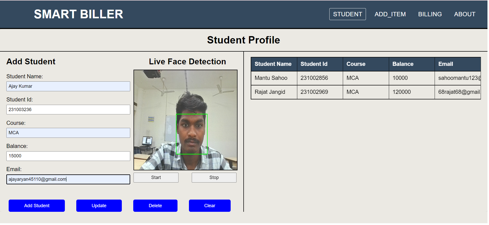

# SMART-BILLER

## Project Overview
SMART-BILLER is an innovative system designed to streamline the management of student accounts using facial recognition technology. The system identifies students and automatically retrieves their profiles, enabling efficient and accurate updates. Administrators can edit account balances, and the system sends instant notifications regarding the account status.

The site is hosted on Vercel and can be accessed at [SMART BILLER](https://smart-biller.vercel.app/).

## Features
- **Facial Recognition**: Identifies students using facial recognition and retrieves their profiles automatically.
- **Profile Management**: Allows updating of student profiles with ease.
- **Balance Editing**: Enables administrators to edit and manage account balances.
- **Instant Notifications**: Sends immediate notifications to students about their account status.

## Technology Stack
- **Frontend**: HTML, CSS, JavaScript,XML
- **Backend**: Python
- **Database**: Firebase

## Installation and Setup
To get started with SMART-BILLER, follow these steps:

1. **Clone the repository**:
    ```bash
    git clone https://github.com/yourusername/smart-biller.git
    cd smart-biller
    ```

2. **Install dependencies**:
    - Ensure you have Python installed.
    - Install necessary Python packages:
      ```bash
      pip install -r requirements.txt
      ```
    - Make sure to include Firebase configuration in your project for backend integration.

3. **Run the application**:
    ```bash
    python app.py
    ```
    - Open `index.html` in your browser to start using the frontend.

## Usage
- **Student Identification**: Use the facial recognition feature to identify a student. The system will automatically retrieve and display the student's profile.
- **Profile Updates**: Modify the student’s details and save them back to the database.
- **Balance Management**: Adjust the student’s account balance as required.
- **Notifications**: Notifications will be sent automatically when there are updates to the student's account.

## Screenshots
Here are some screenshots of the SMART-BILLER application:

### 1. SignUp Page


### 2. Login Page


### 3. Student Profile


### 4. Add Item


### 5. Billing


## Contributing
If you'd like to contribute to SMART-BILLER, please fork the repository and submit a pull request. We welcome all contributions!

## Contact
For any inquiries or issues, please contact us at [ramsproject321@gmail.com](mailto:ramsproject321@gmail.com).

